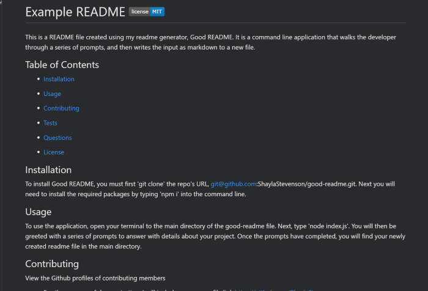

# Good README   
Create a professional readme file for your project in a few simple steps using Good README. This readme generator walks the developer through a series of prompts in the command line, and then writes the input as markdown to a new file. 

## Table of Contents

  * [Installation](#Installation)

  * [Usage](#Usage)

  * [Demo](#Demo)

  * [Technologies](#Technologies)

  * [Questions](#Questions)

  * [License](#License)

  ## Installation
  To install Good README, you must first enter
  * git clone git@github.com:ShaylaStevenson/good-readme.git

  into your terminal. Next you will need to install the required packages by entering
  * npm i
  
  ## Usage
  To use the application, open your terminal to the main directory of the good-readme file. Next, type 'node index.js'. You will then be greeted with a series of prompts to answer with details about your project. Once the prompts have completed, you will find your newly created readme file in the main directory. 

  ## Demo
  Click image to view video walkthrough, or see an [example of a developed readme](example-readme.md).
  

  ## Technologies
  * License badged created using [Shields.io](https://shields.io/)
  * Licenses sourced from [Opensource.org](https://opensource.org/)
  * Demo video made using [Screencastify.com](https://www.screencastify.com/)

  ## Questions
  * Github Username: ShaylaStevenson
  * [View Github Profile](https://github.com/ShaylaStevenson)
  * Email: shayla.rose.stevenson@gmail.com
  * You can also reach me through my [LinkedIn account](https://www.linkedin.com/in/shayla-stevenson-806143200/) .

  ## License
  This project is licensed under the terms of the MIT license. View license at:
  https://opensource.org/licenses/MIT.
